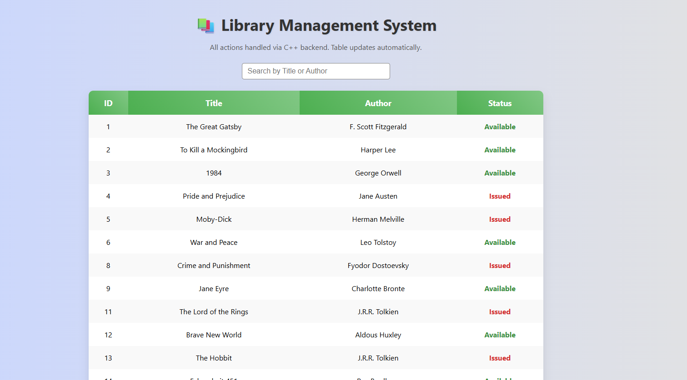
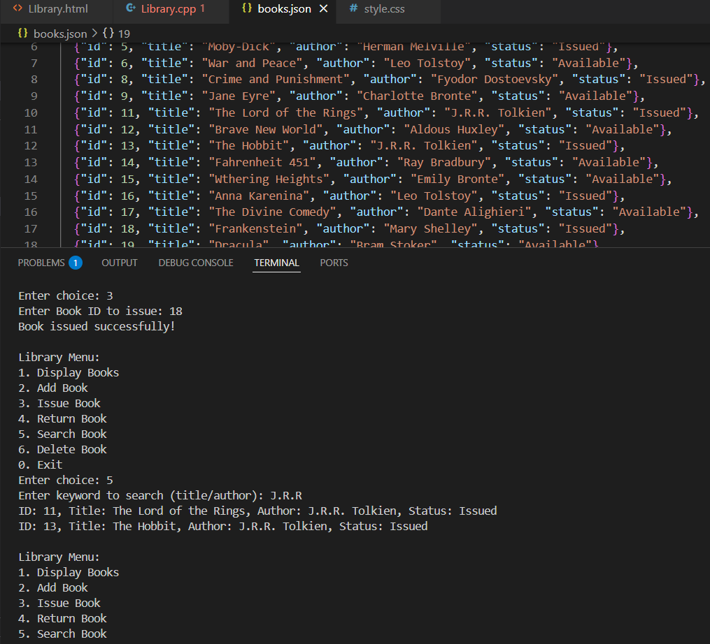

# 📚 Library Management System – C++ + Web UI

A **hybrid console + web project** that manages a library using **C++ backend** and a **modern web interface**.
It demonstrates **OOP, File Handling, JSON integration, and interactive frontend design**.

---

## ✨ Key Features

### 🖥 Backend (C++)

* ✅ Add, Search, Issue, Return, and Delete books
* ✅ Persistent storage with `books.json`
* ✅ Preloaded with **50 real-world books**
* ✅ JSON auto-updates after every change

### 🌐 Frontend (Web UI)

* 🎨 Stylish **table display** for books
* 🔍 **Search bar** for quick filtering
* 📖 **Issue / Return / Delete buttons**
* 💾 Live updates from backend (`books.json`)

---

## 🛠 Tools & Technologies

* ⚡ **C++** – Core backend logic
* 📂 **nlohmann/json** – JSON handling in C++
* 🌍 **HTML5, CSS3, JavaScript** – Web frontend
* 🐍 **Python HTTP Server** – Serve frontend locally

---

## 📁 Project Structure

```
LibraryManagementSystem/
│── cpp/
│   ├── Library.cpp         # Backend code
│   ├── books.json       # Persistent book data
│── frontend/
│   ├── Library.html       # Web interface
│   ├── style.css        # CSS styling
│   ├── script.js        # JS actions
│── screenshots/
│   ├── deleted.png
│   ├── issued,returned.png
│   ├── listOfBooks.png
│   ├── remainingList.png
│   ├── search.png
│   ├── searchedList.png
│── README.md            # This documentation
```

---

## 📸 Project Preview

### 🔹 Frontend (Web UI)

*Display of all books with search and actions*



### 🔹 Backend (C++ Console)

*Console for adding, searching, issuing, returning, and deleting books*



---

## 🚀 How to Run

### 🖥 1️⃣ Run Backend (C++)

```bash
cd cpp
g++ main.cpp -o library
./library
```

* Perform operations (**Add / Search / Issue / Return / Delete**)
* Updates are saved in `books.json`

### 🌐 2️⃣ Run Frontend (Web UI)

```bash
cd ..
python -m http.server 8000
```

* Open browser → [frontend/index.html](/frontend/Library.html)
* Interact with the book table live

---

## 🚧 Future Improvements

* 🔑 User Login (Admin & Students)
* 📊 Borrowing History & Reports
* 📅 Due Date & Fine Calculation
* 📚 Book Categorization (Author / Genre / Year)

---

## 🙋‍♂ About Me

**Sasi Kaladhar**
🎓 B.Tech | Mechanical Engineering @ IIT Patna
📧 [pillisasikaladhar.palasa@gmail.com](mailto:pillisasikaladhar.palasa@gmail.com)
🔗 [GitHub](https://github.com/Sasigit1704)
🔗 [LinkedIn](https://linkedin.com/in/pillisasikaladhar170404)
